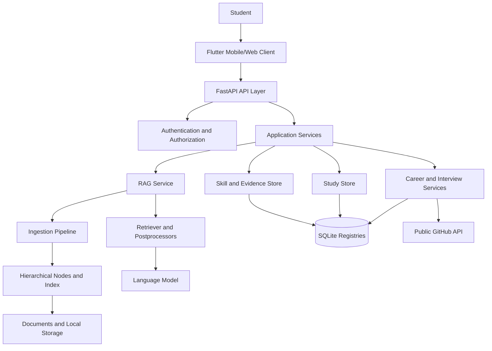
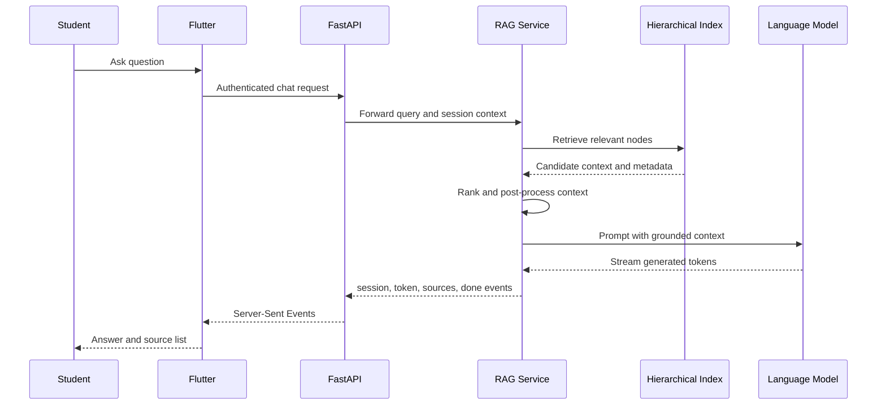

# Academic Second Brain
## An AI-Assisted Retrieval-Augmented Learning and Career Readiness Platform

**Complete Project Report Draft**

**Project type:** Academic software and intelligent information-retrieval system  
**Primary technologies:** Python, FastAPI, RAG, LlamaIndex, SQLite, Flutter, GitHub API  
**Prepared for:** ______________________________  
**Prepared by:** ______________________________  
**Institution:** ______________________________  
**Academic year:** ______________________________  

> **Report note:** This report is written for the Academic Second Brain repository. The supplied outline was originally written for a UAV chassis project, so the same broad academic report structure has been retained while the technical content has been adapted to the implemented learning, RAG, skill, study, and career platform.

---

## Table of Contents

| Chapter | Title | Suggested page |
|---|---|---:|
| - | Acknowledgement | IV |
| - | Abstract | V |
| - | List of Abbreviations | IX |
| 1 | Introduction | 10 |
| 2 | Overview of Academic Second Brain Design | 13 |
| 3 | Literature Review and Technical Foundation | 16 |
| 4 | Existing System and Problem Analysis | 21 |
| 5 | Proposed System | 26 |
| 6 | Methodological Approach | 31 |
| 7 | Design and Implementation | 34 |
| 8 | Results and Discussion | 37 |
| 9 | Applications, Impact, and Future Scope | 41 |
| 10 | References | 43 |
| 11 | Appendix I: Implementation and Test Evidence | 45 |
| 12 | Appendix II: Outputs and Demonstration Record | 52 |

Page numbers are placeholders and should be regenerated after the final document is formatted in Word or LaTeX.

---

# Acknowledgement

I express my sincere gratitude to my project supervisor, faculty members, institution, peers, and family for their guidance and support during the development of the Academic Second Brain platform. Their feedback helped shape the system from a document-question-answering prototype into a broader learning and career-readiness application.

I also acknowledge the open-source communities behind Python, FastAPI, LlamaIndex, SQLite, Flutter, and the other libraries used in this project. These tools made it possible to implement document ingestion, retrieval-augmented generation, structured study workflows, skill evidence management, GitHub synchronization, and a cross-platform mobile interface within a single project.

Finally, I acknowledge the importance of responsible AI development. The project gives special attention to source-grounded answers, evidence-backed career claims, authentication, user ownership, validation, and explicit handling of model uncertainty.

---

# Abstract

Academic learners commonly store notes, lecture material, project documents, repositories, assessments, and career information in separate locations. Conventional search can locate matching words, but it does not reliably understand the learner's context, connect information across sources, or convert retrieved information into a useful study or career action. The Academic Second Brain is designed to address this problem through a Retrieval-Augmented Generation (RAG) architecture combined with a persistent skill graph, study analytics, GitHub evidence synchronization, career tools, and a Flutter mobile client.

The system accepts academic documents and processes them through an ingestion pipeline. Documents are loaded, transformed into structured nodes, embedded or indexed, and made available to a retriever. When a user asks a question, the system retrieves relevant knowledge from the indexed corpus and supplies that context to a language model. The generated response is streamed back with source information so that the answer is grounded in the user's material rather than produced only from general model memory. The same indexed knowledge supports quiz generation, weak-topic detection, adaptive study-plan creation, and interview preparation.

A second major part of the platform is its evidence-backed skill profile. Manual evidence, GitHub repository languages, and quiz activity are represented separately. Taxonomy-backed skills can be used for gap analysis and resume generation, while study-only topics remain useful for learning analytics without automatically becoming career claims. The backend exposes authenticated FastAPI routes, SQLite-backed persistence, document and session services, and structured career and study APIs. The Flutter frontend communicates with the backend on desktop, web, and Android devices.

The project demonstrates how RAG can serve as the central knowledge layer of an educational assistant while other services convert retrieved knowledge into measurable learning actions. The current implementation provides a functional foundation for document-grounded chat, study support, skill tracking, GitHub synchronization, resume generation, interview practice, dashboards, and mobile access. Future work includes stronger evaluation datasets, richer multimodal ingestion, production deployment, improved personalization, and more rigorous learning-outcome measurement.

**Keywords:** Retrieval-Augmented Generation, RAG, educational technology, personal knowledge management, semantic retrieval, study planning, skill graph, career readiness, FastAPI, Flutter.

---

# List of Abbreviations

| Abbreviation | Meaning |
|---|---|
| AI | Artificial Intelligence |
| API | Application Programming Interface |
| BM25 | Best Matching 25 lexical retrieval algorithm |
| CAD | Computer-Aided Design |
| CORS | Cross-Origin Resource Sharing |
| CRUD | Create, Read, Update, Delete |
| DOCX | Microsoft Word Open XML document format |
| FEA | Finite Element Analysis |
| JWT | JSON Web Token |
| LLM | Large Language Model |
| NLU | Natural Language Understanding |
| RAG | Retrieval-Augmented Generation |
| REST | Representational State Transfer |
| SSE | Server-Sent Events |
| UI | User Interface |
| URL | Uniform Resource Locator |
| VM | Virtual Machine |

---

# Chapter 1: Introduction

## 1.1 Background of Intelligent Academic Systems

Students work with information that is distributed across lecture notes, textbooks, research papers, assignments, source-code repositories, personal notes, assessment results, and career documents. The information is valuable, but its usefulness decreases when it cannot be found quickly or connected to a current goal. A learner preparing for an examination may need an explanation from a lecture document, a list of weak topics from previous quizzes, and a schedule for revision. A learner preparing for employment may need to connect coursework, projects, repository activity, and job-description requirements.

An intelligent academic system should therefore do more than provide a chatbot interface. It should establish a trustworthy knowledge layer, preserve the origin of information, understand the learner's history, and convert knowledge into actions. The Academic Second Brain addresses this need through an integrated RAG and learning-management architecture.

## 1.2 Importance of a Personal Knowledge and Skill System

A personal knowledge system is important for four reasons. First, it reduces the time spent searching through documents. Second, it gives the learner a conversational way to explore material. Third, it supports continuous measurement through quiz attempts, weak-topic tracking, and study plans. Fourth, it creates an evidence-based bridge between academic activity and career preparation.

The system is designed around the principle that a generated answer should be connected to retrievable evidence. In the career module, the same principle is applied more strictly: a resume claim should be supported by taxonomy-backed skill evidence and a source reference. This reduces the risk of presenting unsupported or hallucinated achievements.

## 1.3 Problem Statement

Existing academic tools usually solve only one part of the problem. File storage systems preserve documents but do not answer contextual questions. Search systems retrieve keywords but do not explain relationships. Generic language-model chat can produce fluent answers but may not use the student's actual material. Quiz tools measure performance but may not connect weak topics to a study plan. Resume builders generate documents but may include claims that are not supported by evidence.

The problem addressed by this project is the absence of one integrated platform that can:

- ingest and organize academic documents;
- retrieve relevant source material for a user's question;
- generate grounded and source-aware answers;
- create quizzes from indexed content;
- identify weak topics from quiz performance;
- build study plans from weak areas and syllabus material;
- collect skill evidence from manual activity and public GitHub repositories;
- compare current skills with a target role;
- generate evidence-backed career artifacts; and
- expose the complete workflow through a usable mobile interface.

## 1.4 Objectives of the Project

The objectives are to:

1. Build a document-grounded RAG assistant for academic questions.
2. Implement a clear multi-stage pipeline from document ingestion to answer synthesis.
3. Preserve source references and reduce unsupported generation.
4. Store skills, evidence, achievements, projects, quiz attempts, sessions, and career activity.
5. Synchronize public GitHub repository language evidence incrementally.
6. Generate quizzes, calculate rolling topic accuracy, and identify weak topics.
7. Produce personalized study plans and calendar-compatible exports.
8. Support mock technical and behavioral interviews.
9. Generate resume and gap-analysis outputs from validated evidence.
10. Provide an authenticated FastAPI backend and Flutter client, including Android support.

## 1.5 Scope

The project covers the backend services, RAG pipeline, REST and streaming APIs, local persistence, study and career workflows, dashboard aggregation, automated tests, and Flutter frontend integration. It is primarily a development and demonstration system. Production-scale hosting, distributed vector databases, private GitHub OAuth, enterprise identity management, and formal educational outcome studies are outside the current scope.

---

# Chapter 2: Overview of Academic Second Brain Design

## 2.1 System Concept

The Academic Second Brain is a layered application. The Flutter client provides the user experience. FastAPI exposes authenticated and public API operations. Service modules coordinate documents, sessions, skills, study workflows, interviews, career tools, and dashboards. The RAG subsystem provides document understanding and contextual generation. SQLite-backed registries preserve user, skill, evidence, study, and career state.

The RAG subsystem is the central intelligence layer. Other modules use either the retrieved academic context directly or the structured outcomes derived from it. For example, a quiz is generated from eligible indexed leaf nodes, a weak topic is calculated from quiz attempts, and a study plan uses weak topics together with syllabus content.

## 2.2 High-Level Architecture



## 2.3 Main Components

**Frontend:** A Flutter application that consumes the backend API and can run on Android, web, and desktop development targets. The Android application receives the backend URL through `API_BASE_URL` at build or run time.

**API layer:** FastAPI routers validate HTTP input, enforce dependencies, return structured responses, and stream chat responses where required.

**Service layer:** Services isolate application orchestration from HTTP concerns. Important services include authentication, documents, sessions, RAG, skills, study, career, interview, and dashboard services.

**RAG layer:** Ingestion readers, index creation, retrieval, post-processing, and synthesis components operate on the academic corpus.

**Persistence layer:** Document storage, indexes, session data, skill registries, evidence, projects, quiz attempts, plans, interviews, and career outputs are retained through local files and SQLite-backed registries.

**External connectors:** The GitHub connector obtains public repository metadata and language statistics. An optional GitHub token improves API rate limits but is not required for public repository synchronization.

## 2.4 Design Principles

The design follows these principles:

- **Ground answers in the user's corpus.** Retrieval must happen before synthesis.
- **Keep boundaries explicit.** API routers should not own indexing, persistence, or career-generation logic.
- **Preserve evidence.** Source references and confidence should travel with derived skills and claims.
- **Isolate failures.** A malformed quiz item or failed GitHub repository should not discard all valid results.
- **Validate structured output.** Model-generated questions, plans, and career content require schema and business validation.
- **Protect ownership.** Authenticated identity is derived from the JWT rather than trusted from a client-supplied student identifier.
- **Support incremental workflows.** Re-synchronizing the same source should update existing evidence rather than create duplicates.

---

# Chapter 3: Literature Review and Technical Foundation

## 3.1 Retrieval-Augmented Generation

Retrieval-Augmented Generation combines information retrieval with language-model generation. Instead of asking a model to answer only from parameters learned during training, the application first searches an external knowledge collection. Retrieved passages are then included in the model prompt. The model can use the supplied context to produce an answer that is specific to the user's documents and current knowledge base.

A simplified RAG process is:

$$
q \rightarrow R(q, D) = C \rightarrow G(q, C) = a
$$

where $q$ is the user's query, $D$ is the indexed document collection, $R$ is the retrieval function, $C$ is the selected context, $G$ is the generation function, and $a$ is the answer. The quality of the answer depends on both retrieval quality and generation quality. A fluent model cannot compensate for irrelevant context, and a strong retriever cannot help if the model ignores or misinterprets the context.

## 3.2 Document Chunking and Hierarchical Indexing

Long documents cannot normally be inserted into a prompt in their entirety. They are divided into smaller units or nodes. Chunk size, overlap, metadata, and hierarchy affect retrieval quality. Small chunks improve precision but may lose context. Large chunks preserve context but may contain irrelevant material.

The project uses a hierarchical ingestion and indexing approach. Documents are converted into nodes, and the index retains relationships between larger context nodes and more focused leaf nodes. Leaf nodes are especially useful for question and quiz generation because they provide bounded concepts. A hierarchical index also allows retrieval and post-processing to balance local detail with document-level context.

## 3.3 Semantic and Lexical Retrieval

Semantic retrieval represents text as vectors and compares the meaning of a query with the meaning of indexed content. Lexical retrieval, such as BM25, compares terms and their frequency. Semantic retrieval is useful when the question uses different words from the source. Lexical retrieval is useful when exact technical terms, identifiers, formulas, or names matter.

A robust academic assistant benefits from both approaches. The project supports retrieval and document-service behavior that can update BM25-related retrieval state after document changes. This allows newly uploaded material to become available without rebuilding the complete application state manually.

## 3.4 Prompt Synthesis and Streaming

After retrieval, the system constructs a prompt containing the user question, conversation context where applicable, and selected source material. The language model synthesizes the answer. For interactive use, the backend streams output using Server-Sent Events. The expected event sequence includes a session event, token events, a sources event, and a completion marker. Streaming reduces perceived waiting time while preserving source information at the end of the response.

## 3.5 Structured Generation for Learning Workflows

RAG is not limited to open-ended chat. Retrieved content can support structured generation. A quiz generator can ask a model to produce a question, options, and an answer index. The result must then be validated for required fields, unique options, valid answer indexes, and concept tags. A study-plan generator can produce sessions that are then persisted and exported. This combination of model generation and deterministic validation is more reliable than accepting arbitrary model text.

## 3.6 Evidence Graphs and Skill Taxonomies

A skill graph represents a learner's skills as canonical concepts connected to evidence. A raw term such as `py` can be normalized to `Python`. The evidence record can retain the original raw term, source type, source reference, and confidence. This supports explainability and prevents the system from treating every generated topic as a professional skill.

The project distinguishes taxonomy-backed skills from study topics. Manual and GitHub evidence can support resume-grade taxonomy skills. Quiz-only concepts are valuable for weak-topic tracking but are not automatically promoted into professional resume claims.

## 3.7 Research Gap Addressed by the Project

Many educational assistants focus on conversational response, while many career systems focus on static profile data. The Academic Second Brain connects these areas. The same document corpus supports learning questions, quizzes, study plans, interview preparation, and career context. The evidence boundary between study topics and career skills is an important control against unsupported claims.

---

# Chapter 4: Existing System and Problem Analysis

## 4.1 Conventional Academic Workflow

A conventional learner may download documents, search each file separately, maintain a separate quiz application, record skills manually, and prepare a resume in another tool. The workflow requires repeated copying and does not preserve strong links between source material, performance, and career output.

## 4.2 Limitations of Existing Tools

The main limitations are:

- fragmented storage and search;
- weak understanding of natural-language questions;
- no reliable relationship between answers and source passages;
- manual creation of quizzes and revision schedules;
- limited visibility into weak topics over time;
- difficulty converting repository activity into structured evidence;
- risk of unsupported or exaggerated resume claims; and
- inconsistent identity and ownership handling across tools.

## 4.3 Performance and Trust Issues

A generic chatbot may respond quickly but provide an answer unrelated to the learner's uploaded material. A keyword search system may return too many results without synthesis. A model-generated resume may sound convincing while containing claims that are not supported by a source. These problems are not solved by language generation alone. They require retrieval, metadata, validation, persistence, and authorization controls.

## 4.4 Motivation for the Proposed System

The proposed system addresses the limitations by making the RAG pipeline a shared foundation. Documents are ingested once and reused across multiple workflows. Skills are attached to evidence. Quiz outcomes produce measurable study data. Career modules use stricter source and taxonomy rules than ordinary chat. The result is a connected system rather than a collection of independent screens.

---

# Chapter 5: Proposed System

## 5.1 RAG-Centered Academic and Career Framework

The proposed system is centered on a knowledge cycle:

1. The learner uploads or provides knowledge sources.
2. The ingestion pipeline reads and normalizes those sources.
3. The indexing stage creates searchable hierarchical representations.
4. The retriever selects context for a question or generation task.
5. A language model synthesizes a response or structured learning artifact.
6. Deterministic validation checks the result.
7. The system stores the outcome, source information, and learner feedback.
8. Later workflows use that stored information to personalize study and career actions.

RAG is therefore not only a chat feature. It is the shared content intelligence for document questions, quizzes, study planning, interview questions, and contextual career support.

## 5.2 System Architecture and Workflow

The standard question-answering path is:



## 5.3 Design Optimization Strategy

The system optimizes for more than answer fluency. It considers retrieval relevance, source coverage, response latency, structured-output validity, evidence confidence, and user usefulness. The main strategies are:

- hierarchical document representation;
- separate ingestion and retrieval responsibilities;
- retrieval post-processors before generation;
- streaming response delivery;
- bounded repository synchronization;
- per-item error isolation for quizzes and GitHub repositories;
- idempotent evidence keys;
- role and ownership checks; and
- filtering of career claims to validated evidence.

## 5.4 Advantages of the Proposed System

The system provides a unified learner profile, document-grounded answers, reusable retrieval context, measurable weak topics, adaptive study planning, repository-based evidence, structured career support, authenticated APIs, and mobile access. It also provides a traceable route from input source to generated output, which is important for academic trust and debugging.

---

# Chapter 6: Methodological Approach

## 6.1 Input Parameters and Constraints

The primary inputs include academic documents, natural-language questions, session identifiers, student profile information, quiz parameters, quiz answers, weak-topic accuracy, GitHub usernames, job descriptions, target roles, and interview responses.

Important constraints include:

- uploaded content must be readable by the selected document reader;
- model responses must satisfy structured schemas where required;
- GitHub synchronization is bounded by `GITHUB_SYNC_MAX_REPOS`;
- public repository synchronization is supported in version one;
- private GitHub repositories and OAuth are deferred;
- access tokens must be supplied through authorization headers;
- resume claims require taxonomy-backed non-quiz evidence; and
- local mobile use requires the phone to reach the backend host over the network.

## 6.2 RAG Pipeline Stages

### Stage 1: Source acquisition

The source may be an uploaded academic document, a file already present in the data directory, or a source connected through an application workflow. The document service owns upload persistence and coordinates ingestion.

### Stage 2: Document reading

The ingestion reader extracts text and document metadata. The objective is to produce a consistent internal representation while retaining the document identity needed for later source references.

### Stage 3: Normalization and node creation

Extracted text is cleaned and divided into nodes. Nodes represent bounded sections of knowledge. Metadata such as document identity, node identity, and hierarchy is preserved.

### Stage 4: Hierarchical index creation

The ingestion pipeline creates or loads a hierarchical index from the complete node collection. Larger nodes preserve broad context, while leaf nodes support focused retrieval and quiz generation.

### Stage 5: Retriever construction

The system builds a retriever stack over the index. Retrieval identifies candidate nodes related to the query. Lexical and semantic signals can complement each other, especially for technical content.

### Stage 6: Retrieval post-processing

Candidate nodes are filtered, ordered, or transformed before they reach the language model. Post-processing reduces irrelevant context and helps keep the prompt within practical limits.

### Stage 7: Context assembly

The RAG service combines the user query, relevant conversation state, retrieved node text, and source metadata into a generation context. This stage is where the system controls what evidence the model is allowed to use.

### Stage 8: Prompt synthesis

The model receives instructions to answer using the supplied context. For structured tasks, the prompt requests a defined output format rather than unrestricted prose.

### Stage 9: Model generation

The language model produces either streamed answer tokens or structured content such as quiz questions, study sessions, interview questions, or career content.

### Stage 10: Validation and source attachment

Open-ended answers receive source information. Structured outputs pass deterministic validation. Invalid quiz items are isolated and reported rather than silently accepted.

### Stage 11: Persistence and feedback

Sessions, attempts, evidence, plans, projects, achievements, and career activity are stored. User answers and quiz results create feedback that can influence later study recommendations.

### Stage 12: Evaluation and monitoring

The system should be evaluated using retrieval relevance, answer faithfulness, citation/source coverage, structured-output validity, response latency, and task-level outcomes such as quiz improvement. The current repository includes regression and service tests; a larger benchmark dataset is a future enhancement.

## 6.3 Study and Career Methodology

The study methodology uses retrieved document content to generate quizzes, stores attempts, calculates rolling accuracy, and identifies topics below a threshold. The study-plan workflow combines weak topics with syllabus material and creates sessions that can be exported as an `.ics` calendar file.

The career methodology treats evidence as a first-class object. GitHub language data is normalized into skills and linked to stable repository references. Gap analysis compares taxonomy skills with a job description. Resume generation is restricted to evidence-supported claims, and the system rejects deliberately ungrounded output rather than producing an unreliable document.

---

# Chapter 7: Design and Implementation

## 7.1 Software Tools and Technologies Used

| Layer | Technology | Purpose |
|---|---|---|
| Backend language | Python | Application and RAG implementation |
| API framework | FastAPI | REST, validation, authentication dependencies, streaming |
| RAG framework | LlamaIndex components | Ingestion, indexing, retrieval, and model integration |
| Persistence | SQLite and local stores | Users, sessions, skills, evidence, study, and career records |
| Language model | Configurable external LLM | Answer and structured-content synthesis |
| Embeddings | OpenAI-compatible embedding endpoint | Semantic document representation |
| External integration | GitHub REST API | Public repository and language evidence |
| Frontend | Flutter and Dart | Mobile, web, and desktop client |
| Testing | Python unittest and Flutter analysis/tests | Regression and client validation |
| Document output | DOCX and ICS generation | Resume and calendar exports |

## 7.2 Backend Modules

The backend entrypoint initializes authentication, skills, study, and career registries. During startup it loads the academic data path, runs ingestion, creates or loads the hierarchical index, builds the retriever stack, and stores the RAG and application services in FastAPI application state.

The API modules expose routes for authentication, administration, chat, documents, GitHub, skills, study, career, sessions, and dashboards. The service modules hold orchestration logic so that API routes remain focused on HTTP inputs, authorization, response construction, and streaming.

## 7.3 Document and RAG Implementation

Document upload and deletion are owned by the document service. Upload processing persists the document, runs ingestion, updates retrieval state, and supports deletion delegation. The RAG service delegates conversational generation to the existing streaming chat flow and preserves session, token, source, and completion events.

The RAG pipeline is initialized during application lifespan. This means the application should report readiness only after the retriever and related services have been created. The `/health` endpoint reports the service status and whether the retrieval pipeline is ready.

## 7.4 Authentication and Authorization

The system exposes signup, login, refresh, logout, and current-user operations. Protected routes use bearer access tokens. The backend derives ownership from the JWT subject rather than relying on a client-supplied student identifier. Refresh tokens are rotated and logout revokes the supplied refresh token. Administrative routes require an authenticated administrator.

## 7.5 Skills and Evidence

The skill store contains canonical skill records, evidence records, and achievements. Evidence includes source type, source reference, raw term, confidence, and timestamps. Idempotency is based on the student, skill, source type, and source reference, so repeated synchronization updates existing evidence rather than creating duplicates.

The taxonomy distinguishes career-grade skills from study topics. This prevents a quiz-only topic from automatically becoming a professional claim. Manual and GitHub evidence can support taxonomy-backed career operations.

## 7.6 GitHub Connector

The GitHub connector requests public repositories for a username, retrieves language statistics for each repository, creates or updates a project record, and writes language evidence. Repository failures are collected in an error list while successful repositories remain processed. An optional `GITHUB_TOKEN` improves rate limits, and `GITHUB_SYNC_MAX_REPOS` bounds work.

## 7.7 Study System

The study system generates quizzes from indexed document leaf nodes. It validates generated questions, rejects duplicate options and invalid answer indexes, and reports malformed items without discarding valid questions. Attempts are persisted and used to calculate rolling accuracy and weak topics. Study plans use syllabus content and weak topics, and their sessions can be exported to a calendar file.

## 7.8 Career Tools and Dashboard

Gap analysis identifies required taxonomy skills that are not already evidenced. Resume generation creates a DOCX only after validating generated claims against source references. Interview sessions use the existing session store with a dedicated interview session type. The dashboard aggregates profile information, skills, evidence confidence, quiz mastery, weak topics, projects, achievements, and recent career activity.

## 7.9 Flutter Mobile Client

The Flutter application communicates with the FastAPI backend through a configurable base URL. For a physical Android device, `127.0.0.1` refers to the phone itself and therefore cannot reach the computer backend. The application is run with a LAN address such as `http://192.168.137.1:8000` when that address is reachable from the phone. The Android manifest includes internet permission and permits local cleartext HTTP for development.

---

# Chapter 8: Results and Discussion

## 8.1 Functional Results

The implemented system provides the following functional results:

- academic documents can be indexed for retrieval;
- chat responses can be delivered through a streaming API;
- source events can accompany generated answers;
- documents can be uploaded, listed, and deleted;
- authenticated user sessions can be created and refreshed;
- skills can be created from normalized evidence;
- public GitHub repositories can contribute language evidence;
- quizzes can be generated from indexed leaf nodes;
- quiz attempts can be stored and summarized;
- weak topics can be calculated from rolling accuracy;
- study plans can be created and exported;
- interviews can be started, continued, and ended;
- job descriptions can be analyzed for skill gaps;
- validated resume documents can be generated; and
- dashboard data can be aggregated for a student.

## 8.2 RAG Performance Analysis

The most important RAG dimensions for evaluation are:

| Dimension | Measurement approach |
|---|---|
| Retrieval relevance | Human or benchmark judgment of whether retrieved nodes answer the query |
| Context precision | Proportion of retrieved context that is useful rather than distracting |
| Context recall | Proportion of required source information retrieved |
| Faithfulness | Whether the response is supported by retrieved material |
| Source coverage | Whether important answer claims have source references |
| Structured validity | Percentage of generated quizzes/plans that pass validation |
| Latency | Time to first token and total response time |
| Learning value | Change in quiz accuracy or completion after recommendations |

The current implementation includes service-level and phase-level regression tests, mocked GitHub tests, quiz validation tests, career grounding tests, dashboard tests, and authentication tests. A complete academic evaluation should add a frozen benchmark containing representative documents, questions, expected sources, and answer-quality labels.

## 8.3 Comparison with Traditional Designs

| Capability | Conventional workflow | Academic Second Brain |
|---|---|---|
| Document search | Manual or keyword-based | Retrieval plus model synthesis |
| Source traceability | Often absent | Source metadata returned with answers |
| Quiz creation | Manual | Generated from indexed content and validated |
| Weak-topic analysis | Separate spreadsheet or absent | Stored attempts and rolling accuracy |
| Study planning | Manual scheduling | Weak-topic and syllabus-driven plans |
| Skill evidence | Manually typed profile | Evidence from manual, quiz, and GitHub sources |
| Resume claims | User or model authored | Filtered through taxonomy and source evidence |
| Career gap analysis | Manual comparison | Job-description and skill-taxonomy comparison |
| Access | Usually one platform | FastAPI backend with Flutter client |

## 8.4 Discussion of AI-Driven Effectiveness

The system is effective when the relevant source material has been ingested, retrieval returns useful nodes, and the model follows the grounding instructions. Its main advantage is the reuse of one academic knowledge layer across several workflows. Its main limitation is that generation quality remains dependent on document quality, chunking, retrieval configuration, model behavior, and validation coverage.

The evidence boundary is particularly important. RAG can help the system explain academic content, but it should not be treated as proof that a learner possesses a professional skill. The project therefore separates study topics from taxonomy-backed career skills and requires source-grounded claims for resume generation.

## 8.5 Current Runtime Observation

During Android testing, the application built and installed successfully on a Pixel device when launched with the LAN API URL. Runtime logs also exposed a duplicate `GlobalKey` warning and related Flutter layout assertions in an interaction flow. This is an implementation issue to resolve before claiming production-ready mobile stability. It does not invalidate the backend or the successful Android build, but it should be recorded as a known defect and covered by a focused widget or integration test.

---

# Chapter 9: Applications, Impact, and Future Scope

## 9.1 Applications

The platform can be used for:

- examination preparation from lecture notes and textbooks;
- conversational exploration of personal academic material;
- automatic formative assessment;
- identification of weak concepts;
- calendar-based study planning;
- project and skill portfolio construction;
- repository-informed career preparation;
- job-description gap analysis;
- evidence-backed resume drafting;
- mock technical and behavioral interviews; and
- student progress dashboards.

## 9.2 Economic and Educational Impact

The system can reduce repetitive search and preparation work, make learning gaps more visible, and help students convert project activity into structured evidence. It can also support institutions that want a common learning assistant architecture without forcing every learner to use the same notes or study sequence.

The economic impact is potentially strongest in reducing the time required to organize documents, create revision material, compare skills with job requirements, and draft career documents. The educational impact should be measured carefully. Faster answer generation is not sufficient evidence of learning; improvement in retention, accuracy, confidence, and independent problem-solving should be evaluated.

## 9.3 Security, Privacy, and Responsible AI

The project should be deployed with secrets stored in environment variables and excluded from version control. GitHub tokens, model keys, admin signup keys, and database credentials must never be committed. Access tokens should not be placed in URLs. Authenticated ownership should be enforced server-side. Uploaded academic documents may contain personal or confidential information and should be protected with appropriate storage and retention policies.

Generated answers should be presented as assisted explanations rather than unquestionable truth. Source references, confidence indicators, and explicit error reporting improve user trust. Career outputs require stronger controls because unsupported claims can damage a learner's professional profile.

## 9.4 Limitations

Current limitations include local or development-oriented persistence, dependence on external language-model and embedding services, public-only GitHub synchronization, incomplete large-scale retrieval benchmarking, potential stale indexes after unusual file operations, limited multilingual support, and the unresolved duplicate-GlobalKey mobile runtime issue observed during testing.

## 9.5 Future Enhancements

Future work may include:

1. Add a formal RAG evaluation set with retrieval and faithfulness labels.
2. Add hybrid vector and BM25 retrieval with configurable weighting.
3. Add reranking models and query rewriting for difficult questions.
4. Add citations at claim or paragraph level.
5. Add OCR and multimodal ingestion for scanned notes, diagrams, and slides.
6. Add private GitHub access through a secure OAuth flow.
7. Add spaced repetition and richer learner modeling.
8. Add production PostgreSQL and managed vector storage.
9. Add background ingestion jobs and progress reporting.
10. Add observability for latency, token usage, retrieval quality, and errors.
11. Fix and test duplicate widget-key behavior in the Flutter client.
12. Deploy the backend behind HTTPS with managed secrets and rate limits.

## 9.6 Conclusion

The Academic Second Brain demonstrates a practical way to use RAG as the central element of an educational and career-readiness platform. The system does not treat generation as an isolated chatbot capability. Instead, it connects document ingestion, hierarchical indexing, retrieval, synthesis, source tracking, structured study generation, evidence management, and career validation into one workflow.

The implementation provides a strong foundation for a personal academic assistant. Its most important design decision is the separation between retrieved knowledge, generated content, and validated evidence. This separation makes it possible to support flexible learning interactions while applying stricter rules to career claims. With additional evaluation, mobile stability work, production infrastructure, and privacy controls, the system can evolve from a development prototype into a dependable learning companion.

---

# Chapter 10: References

Use the following references as a starting bibliography and replace or supplement them with the citation style required by the institution.

1. Lewis, P. et al. “Retrieval-Augmented Generation for Knowledge-Intensive NLP Tasks.” *Advances in Neural Information Processing Systems*.
2. Robertson, S. and Zaragoza, H. “The Probabilistic Relevance Framework: BM25 and Beyond.” *Foundations and Trends in Information Retrieval*.
3. LlamaIndex Documentation. “Data Framework for LLM Applications.” Available at: https://docs.llamaindex.ai/
4. FastAPI Documentation. “FastAPI Framework, High Performance, Easy to Learn.” Available at: https://fastapi.tiangolo.com/
5. Flutter Documentation. “Build Apps for Any Screen.” Available at: https://docs.flutter.dev/
6. GitHub REST API Documentation. “Repositories and Repository Languages.” Available at: https://docs.github.com/en/rest
7. SQLite Documentation. “SQLite Database Engine.” Available at: https://www.sqlite.org/docs.html
8. OWASP Foundation. *OWASP Application Security Verification Standard*.
9. ISO/IEC 25010. *Systems and Software Quality Requirements and Evaluation: System and Software Quality Models*.
10. Project source code and phase documentation in the AcademicSecondBrain repository.

---

# Appendix I: Implementation and Test Evidence

## A. Repository Structure

The main backend structure is:

```text
AcademicSecondBrain/
  main.py
  pyproject.toml
  requirements.txt
  src/
    api/
    data/
    rag/
    services/
  tests/
  docs/
```

The frontend structure is:

```text
frontend/
  pubspec.yaml
  lib/
    models/
    screens/
    services/
  android/
  test/
```

## B. Important API Groups

| API group | Responsibility |
|---|---|
| `/api/auth` | Signup, login, refresh, logout, current user |
| `/api/admin` | Protected administrative management |
| `/api/chat` | Streaming RAG chat and sessions |
| `/api/docs` | Document upload, listing, and deletion |
| `/api/skills` | Skills, evidence, achievements, GitHub synchronization |
| `/api/study` | Quizzes, attempts, weak topics, plans |
| `/api/career` | Resume, gap analysis, interviews, dashboard-related activity |
| `/health` | Backend and RAG readiness |

## C. Verification Commands

Backend regression tests:

```powershell
uv run python -m unittest discover -s tests -v
```

Python compilation check:

```powershell
uv run python -m compileall -q main.py src tests
```

Flutter dependency and static analysis:

```powershell
cd frontend
flutter pub get
flutter analyze
```

Android device launch during local development:

```powershell
flutter run -d 61121XEBF4YB8B `
  --dart-define=API_BASE_URL=http://192.168.137.1:8000
```

Backend health check:

```powershell
Invoke-RestMethod http://127.0.0.1:8000/health
```

## D. RAG Verification Checklist

- [ ] The backend starts without a missing model or embedding configuration.
- [ ] `/health` reports `pipeline_ready: true`.
- [ ] A source document appears in the document list.
- [ ] A question about the document returns an answer.
- [ ] The response contains source information.
- [ ] A document deletion removes or invalidates its searchable content.
- [ ] A newly uploaded document becomes searchable after ingestion.
- [ ] A malformed structured model response is reported as an error.
- [ ] Valid quiz items remain available when another item fails.
- [ ] Repeated evidence synchronization does not create duplicate rows.

## E. Test Evidence Table

| Test area | Command or scenario | Result | Evidence location |
|---|---|---|---|
| Authentication | `tests/test_auth.py` | Fill after final run | Test output |
| Skills | `tests/test_skills.py` | Fill after final run | Test output |
| GitHub connector | `tests/test_github_service.py` | Fill after final run | Test output |
| Study system | `tests/test_study.py` | Fill after final run | Test output |
| Career | `tests/test_career.py` | Fill after final run | Test output |
| Dashboard | `tests/test_dashboard.py` | Fill after final run | Test output |
| Flutter analysis | `flutter analyze` | Passed during development | Terminal output |
| Android build | `flutter run` on Pixel 9a | Built and installed; runtime key issue recorded | Device logs |

---

# Appendix II: Outputs and Demonstration Record

## A. Demonstration Scenario

1. Start the backend from `AcademicSecondBrain`.
2. Confirm the health endpoint.
3. Create or log in as a student.
4. Upload a syllabus or academic document.
5. Ask a question and capture the streamed answer and sources.
6. Generate a small quiz from the document.
7. Submit correct and incorrect attempts.
8. Retrieve weak topics.
9. Generate and export a study plan.
10. Add or synchronize a GitHub repository.
11. Run gap analysis against a target job description.
12. Generate a resume and verify that every claim has evidence.
13. Start, continue, and end a mock interview.
14. Open the dashboard and capture summary metrics.
15. Repeat selected flows from the Flutter mobile client.

## B. Expected Output Record

For every demonstration, record:

- date and time;
- environment and operating system;
- backend commit or version;
- model and embedding configuration without exposing secrets;
- input document names;
- question or request;
- retrieved source identifiers;
- generated output;
- HTTP status code;
- latency where available;
- validation errors;
- screenshots or exported files; and
- evaluator comments.

## C. Figures to Add to the Final Printed Report

- Overall system architecture diagram.
- RAG ingestion-to-answer pipeline.
- Database or evidence-graph model.
- Flutter application screenshots.
- Swagger API screenshots.
- Document upload and retrieval demonstration.
- Quiz and weak-topic output.
- Study-plan calendar export.
- GitHub evidence synchronization output.
- Gap-analysis and resume output.
- Career readiness dashboard.

## D. Final Report Completion Checklist

- [ ] Replace cover-page placeholders.
- [ ] Insert institution-approved declaration and certificate pages.
- [ ] Add names of supervisor and contributors.
- [ ] Run all backend tests and paste the final result.
- [ ] Capture final screenshots from the working application.
- [ ] Add measured retrieval, response, and quiz results.
- [ ] Verify all references and citation formatting.
- [ ] Update page numbers after formatting.
- [ ] Document the duplicate-GlobalKey fix and rerun mobile testing.
- [ ] Remove secrets, tokens, personal data, and temporary paths from the final report.
